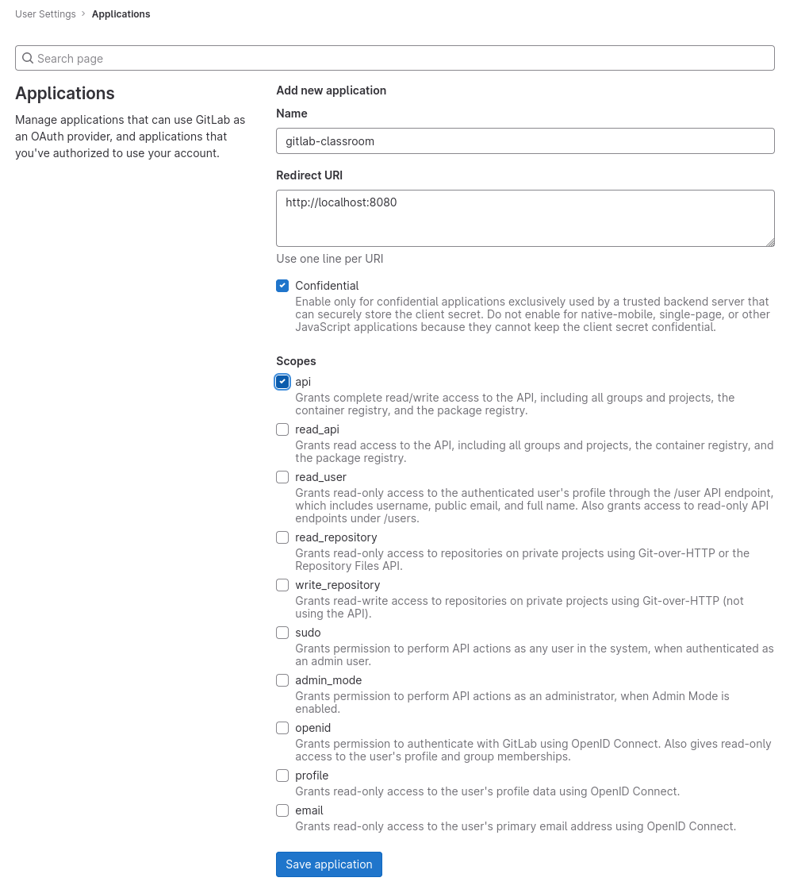
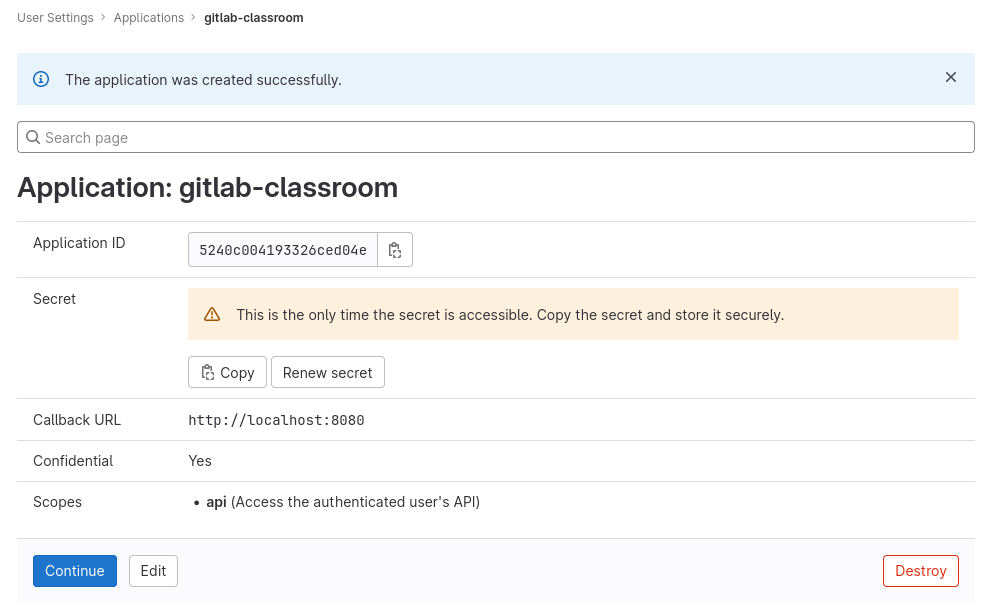

# GitLab configuration

## Create an Application in your GitLab instance

Here is the procedure to register _GitLab Classroom_ as a _GitLab Application_ on any GitLab instance.

Login to your GitLab instance, and open the `/-/profile/applications` page.

<figure markdown>
  { style="border: solid 1px black" }
  <figcaption>GitLab Create Application page</figcaption>
</figure>

Input a name, the `URI` at which _Gitlab CLassroom_ is deployed, and select the `api` scope.

Then click on _Save Application_ to create the application.

Gitlab will then return with an _Application Id_, and a _Secret_.

Save these for later.

<figure markdown>
  { style="border: solid 1px black" }
  <figcaption>GitLab Created Application page with Application ID and Secret</figcaption>
</figure>

## Configure GitLab connectivity using env vars

| env var                | usage                                                               | default value |
|------------------------|---------------------------------------------------------------------|---------------|
| `GITLAB_URL`           | URL of the Gitlab instance                                          |               |
| `GITLAB_CLIENT_ID`     | Application ID generated when registering the application on Gitlab |               |
| `GITLAB_CLIENT_SECRET` | Secret  generated when registering the application on Gitlab        |               |
