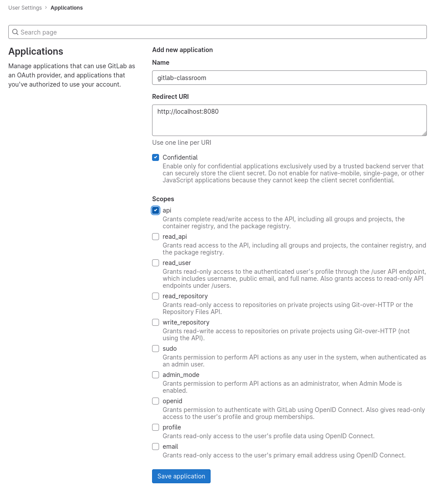
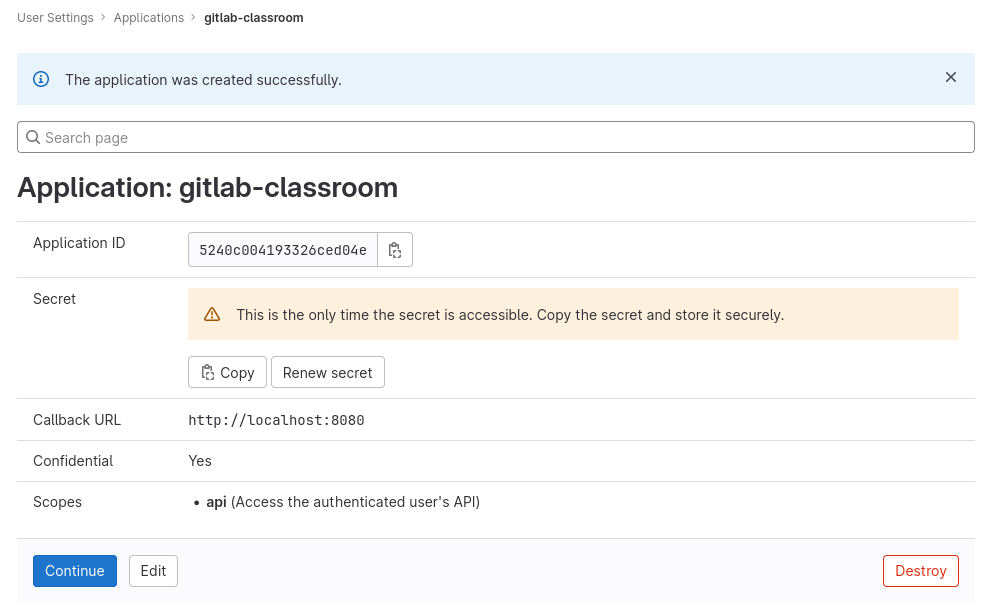

# gitlab configuration

Here is the procedure to register _Gitlab Classroom_ as a Gitlab application on any Gitlab instance.

Login to your Gitlab instance, and open the `/-/profile/applications` page.

Input a name, the `URI` at which _Gitlab CLassroom_ is deployed, and select the `api` scope.

Then click on _Save Application_ to create the application.

Gitlab will then return with an _Application Id_, and a _Secret_.

Save these for later.

## Configure Gitlab connectivity using env vars

| env var                | usage                                                               | default value |
|------------------------|---------------------------------------------------------------------|---------------|
| `GITLAB_URL`           | URL of the Gitlab instance                                          |               |
| `GITLAB_CLIENT_ID`     | Application ID generated when registering the application on Gitlab |               |
| `GITLAB_CLIENT_SECRET` | Secret  generated when registering the application on Gitlab        |               |
