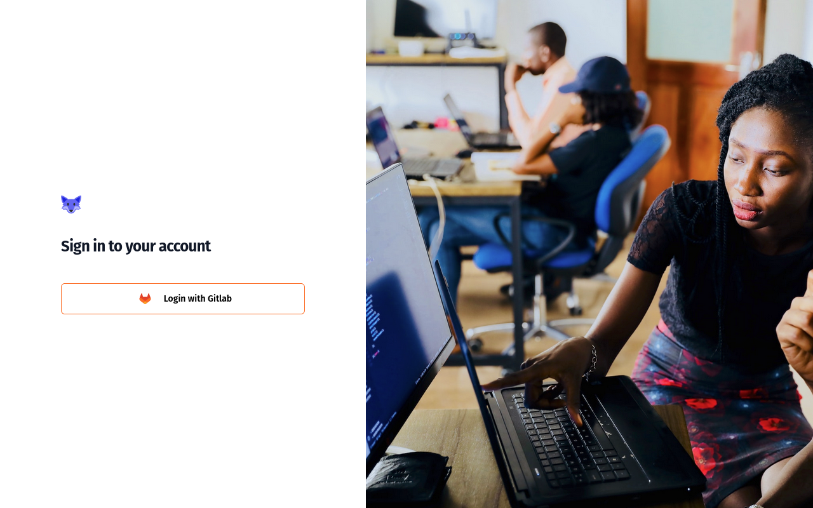
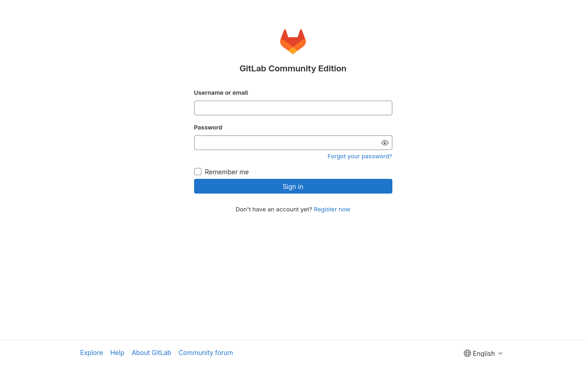
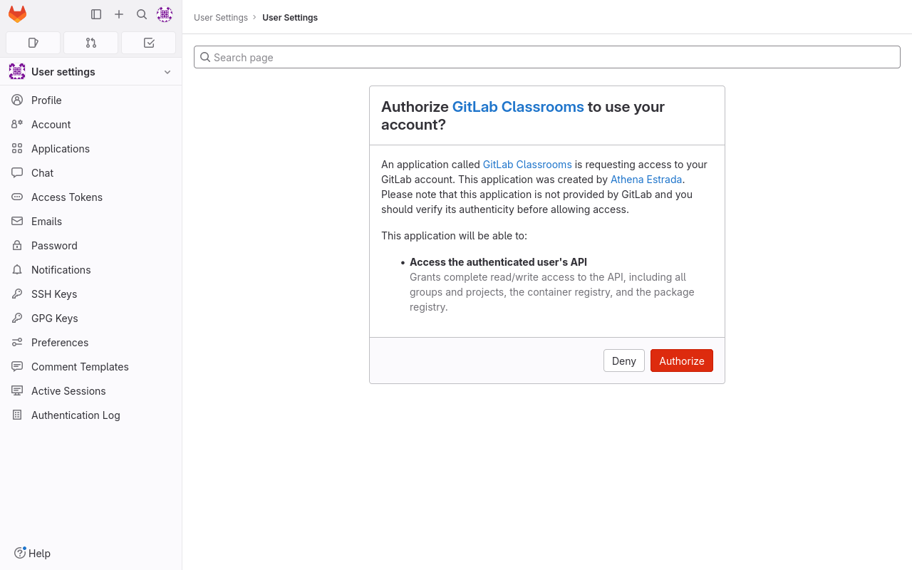
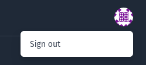

# Login to GitLab Classrooms

## Login to GitLab Classrooms

When accessing GitLab Classroom, a login page will show.

<figure markdown>
  { style="border: solid 1px black" }
  <figcaption>GitLab Classroom login page</figcaption>
</figure>

When clicking the _Login with Gitlab_ button, you will be redirected to the connected GitLab instance login page.

<figure markdown>
  { style="border: solid 1px black" }
  <figcaption>GitLab login page</figcaption>
</figure>

Depending on the GitLab instance configuration, you can be redirected to a corporate login page instead of the GitLab page itself.

If you're already connected to your GitLab instance, the login page may not be showed.

## Authorizing GitLab Classroom to access your GitLab account

When you first login to GitLab Classrooms, GitLab will ask you to authorize your GitLab account.

<figure markdown>
  { style="border: solid 1px black" }
  <figcaption>GitLab authorization page</figcaption>
</figure>

Click _Authorize_ to allow GitLab Classrooms to access your account.
Otherwise, GitLab Classrooms will not be able to manage your classrooms or assignments for you.

After that, you will be redirected to GitLab Classrooms, on the _Student Dashboard_ page.

<figure markdown>
  { style="border: solid 1px black" }
  <figcaption>Student Dashboard page</figcaption>
</figure>

By default, a _Student_ role is given to all users.

See [Student documentation](./student/01-student-dashboard.md) or [Teacher documentation](./teacher/01-teacher-dashboard.md) depending on your role.

## Logout

On every page, at the top-right corner, your GitLab avater is displayed.
Clicking your avatar will show a popup menu, with a _Sign Out_ button.

<figure markdown>
  { style="border: solid 1px black" }
  <figcaption>Logout Menu</figcaption>
</figure>

Clicking the button will log you out of _GitLab Classroom_, and redirect you to the Login page.
You will not be logged-out from GitLab though.
