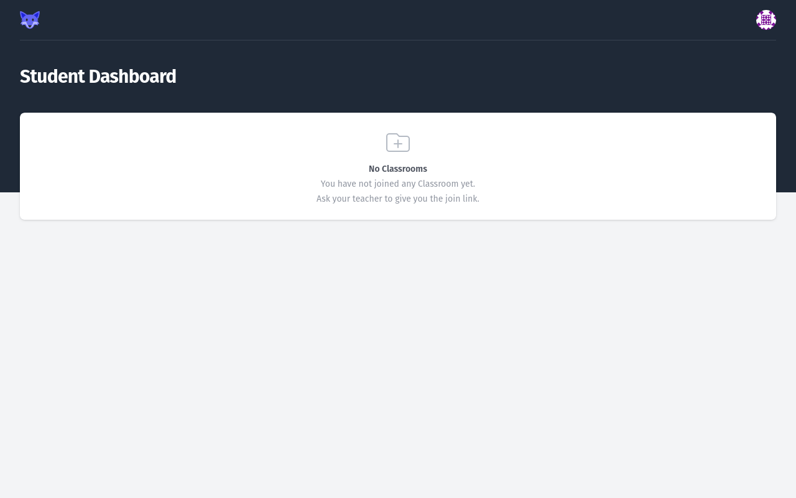
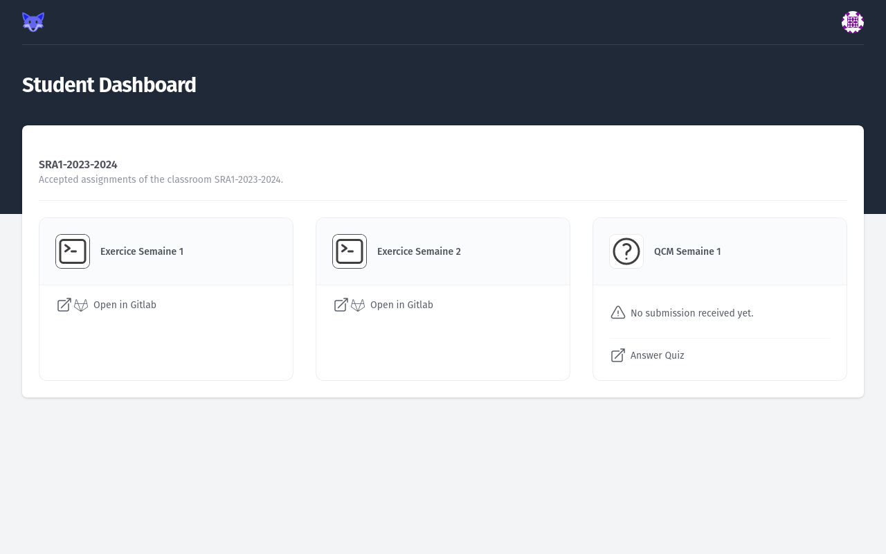
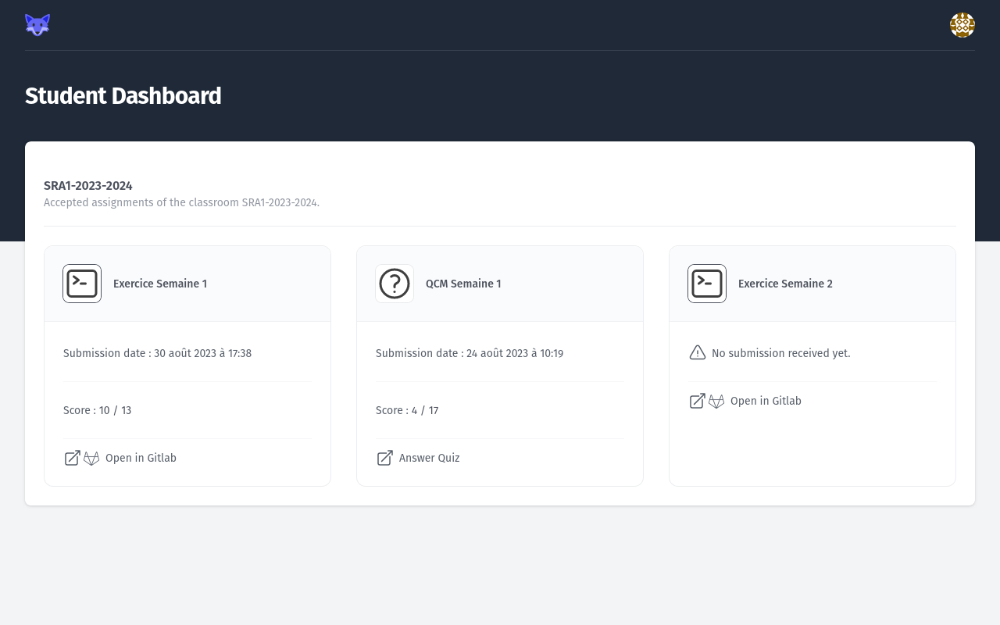

# Using the _Student Dashboard_

## Empty state

When empty, the _Student Dashboard_ does not display anything.

<figure markdown>
  { style="border: solid 1px black" }
  <figcaption>Empty Student Dashboard</figcaption>
</figure>

## Typical _Student Dashboard_

A Typical _Student Dashboard_ contains one or more _Classroom_, each with some _Assignments_.

<figure markdown>
  { style="border: solid 1px black" }
  <figcaption>Student Dashboard with Assignments</figcaption>
</figure>

Each _Assignment_ card displays its type with an icon (Exercise or Quiz).

_Exercise Assignments_ show a link to open the associated GitLab project.

_Quiz Assignments_ show a link to take the associated Quiz.

When a Quiz, or Exercise has been submitted, the submission date and score is also displayed on the card.

<figure markdown>
  { style="border: solid 1px black" }
  <figcaption>Student Dashboard with a Quiz Assignment and Exercise Assignment Scored</figcaption>
</figure>
