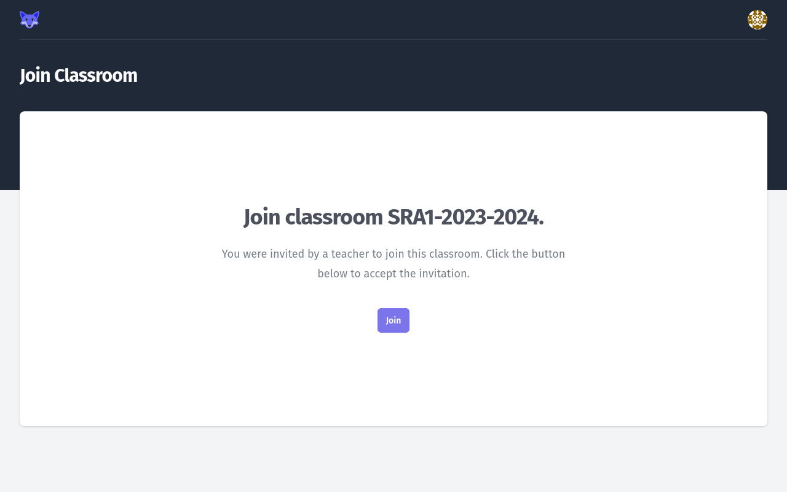
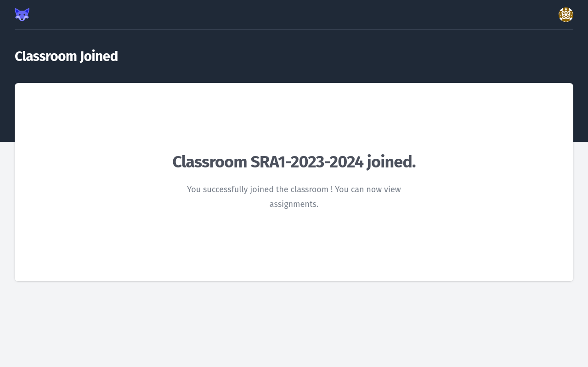
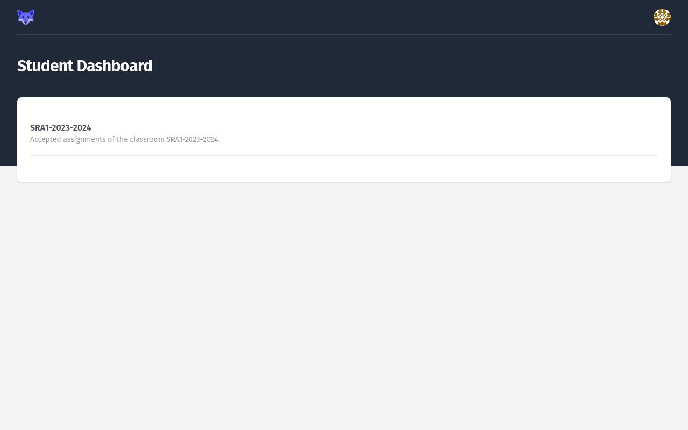

# Joining a _Classroom_

A _Teacher_ may give you a _Join Link_.

These links have the following form : `http://gitlab-classrooms.com/classrooms/04baf115-b2ca-4120-99e3-4cb385595a49/join`.

When clicking this link, you **MAY** be redirected to the _GitLab Classroom_ login page first, then you will see the _Join Classroom_ page.

<figure markdown>
  { style="border: solid 1px black" }
  <figcaption>Join Classroom page</figcaption>
</figure>

When clicking _Join_, your _Student_ account will be connected to the _Classroom_.

You will see a confirmation page.

<figure markdown>
  { style="border: solid 1px black" }
  <figcaption>Join Classroom confirmation page</figcaption>
</figure>

You will be able to _Accept Assignments_, and view your accepted assignments and scores on your _Student Dashboard_.

<figure markdown>
  { style="border: solid 1px black" }
  <figcaption>Your Student Dashboard after joining your first Classroom</figcaption>
</figure>
