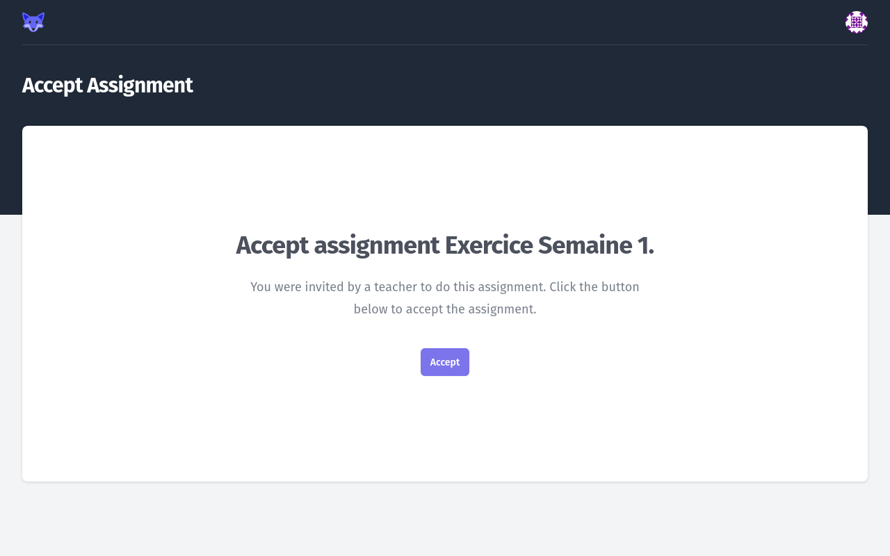
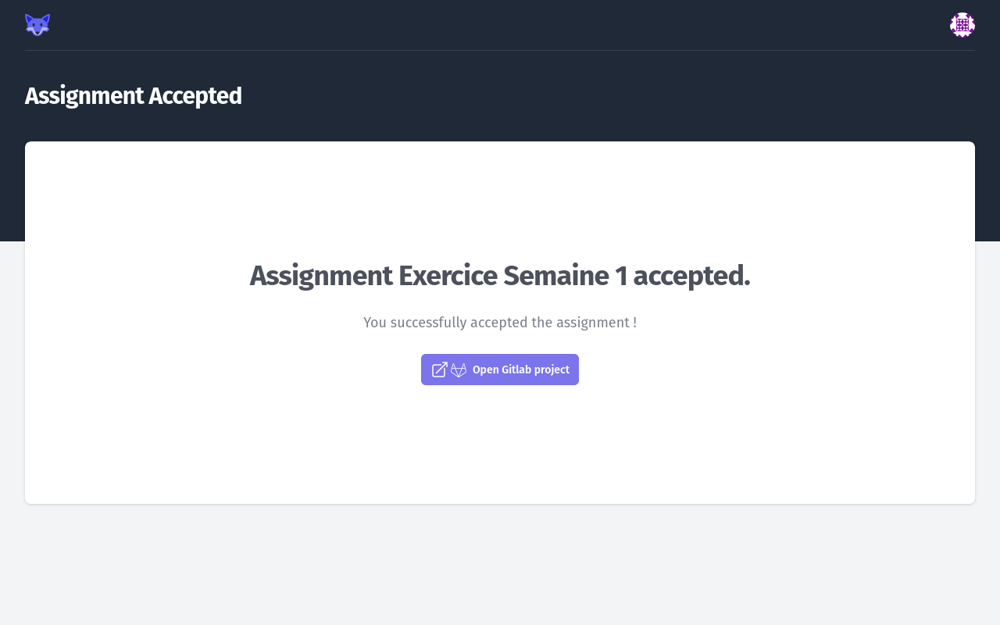
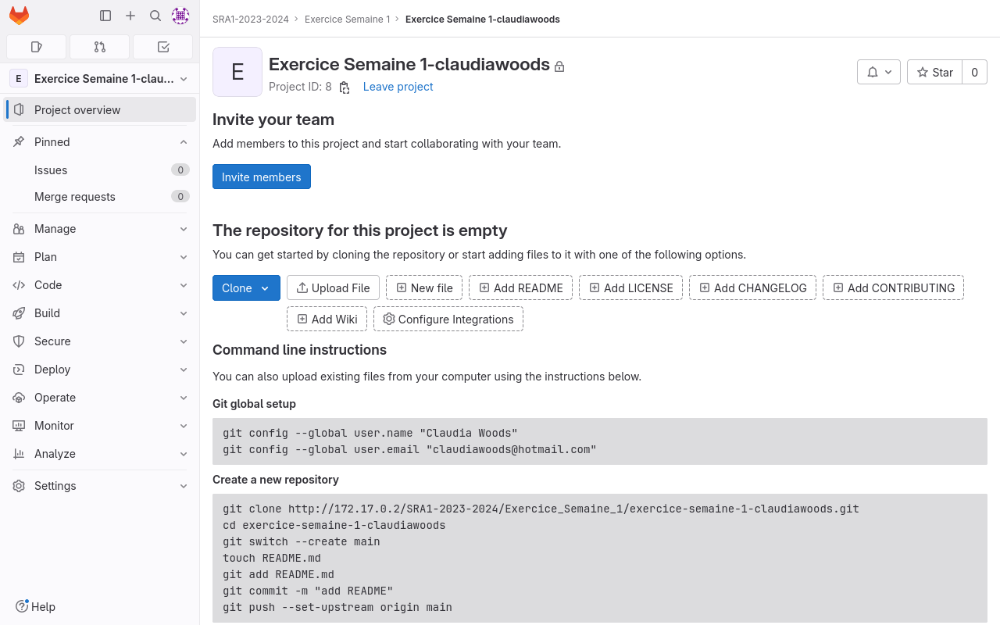
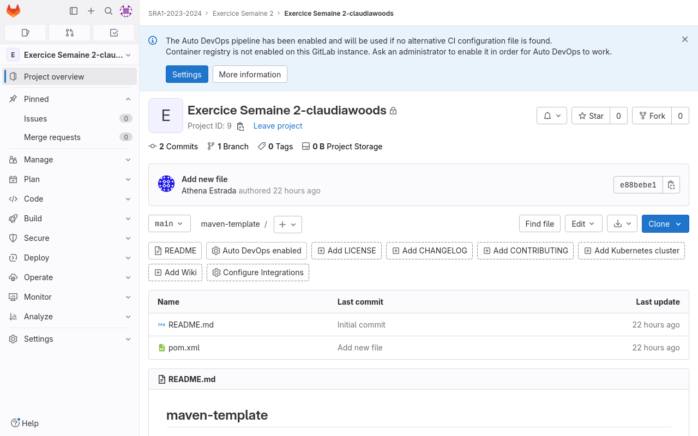
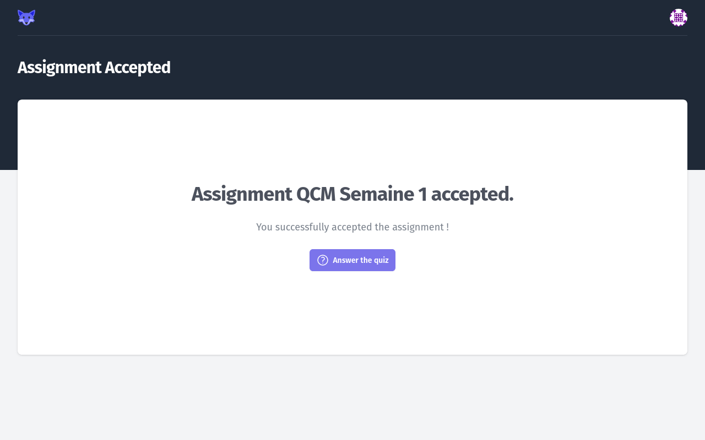

# Accepting an _Assignment_

A _Teacher_ may give you a _Accept Link_ for an _Assignment_.

These links have the following form : `http://gitlab-classrooms.com/assignments/b0f85e34-2377-4855-8de3-a238aaf17842/accept`.

When clicking this link, you **MAY** be redirected to the _GitLab Classroom_ login page first, then you will see the _Accept Assignment_ page.

<figure markdown>
  { style="border: solid 1px black" }
  <figcaption>Accept Assignment page</figcaption>
</figure>

When clicking _Accept_, your _Student_ account will be connected to the _Assignment_.

You will then see a confirmation page.

After accepting an _Assignment_, it will also be displayed on your _Dashboard_.

## Exercise Assignments

In the case of _Exercise Assignments_, a **private** GitLab project will be created for you, in the GitLab group of the _Assignment_.
You will also be granted **MAINTAINER** access level to this project.
Only you and your _Teacher_ will be able to view your project in GitLab.

<figure markdown>
  { style="border: solid 1px black" }
  <figcaption>Accept Exercise Assignment confirmation page</figcaption>
</figure>

The _Accept Exercise Assignment_ confirmation page also gives you a direct link to open the newly created GitLab project.

<figure markdown>
  { style="border: solid 1px black" }
  <figcaption>Exercise Assignment GitLab project</figcaption>
</figure>

Depending on the _Assignment_, your project will be empty, or will come with a code template.

<figure markdown>
  { style="border: solid 1px black" }
  <figcaption>Exercise Assignment GitLab project, loaded with a code template</figcaption>
</figure>

## Quiz Assignments

In the case of _Quiz Assignments_, no GitLab project will be created
You have to accept the _Assignment_, and take the multi-choice question quiz.

<figure markdown>
  { style="border: solid 1px black" }
  <figcaption>Accept Quiz Assignment page</figcaption>
</figure>

The confirmation page gives you the link to take the Quiz.

<figure markdown>
  { style="border: solid 1px black" }
  <figcaption>Accept Quiz Assignment confirmation page</figcaption>
</figure>
