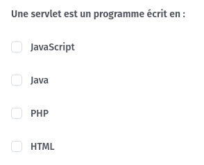
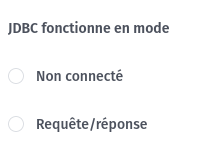
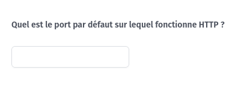
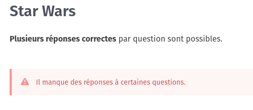
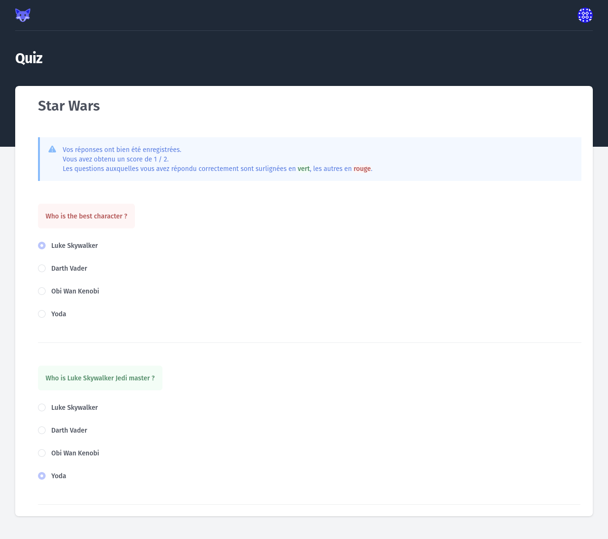
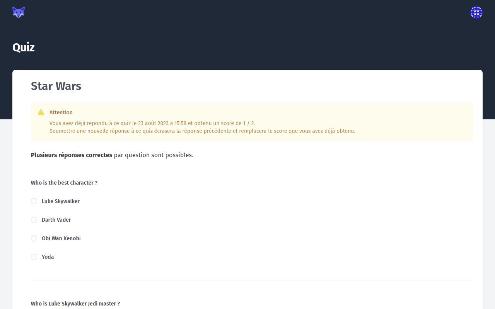

# Taking a Quiz

By cliking on the _Answer Quiz_ link from your [_Student Dashboard_](./01-student-dashboard.md), or after accepting a _Assignment_, you open the Quiz Page.

## Question types

There are 3 types of questions:

* multiple-choice questions, using checkboxes. There can be one or more correct response can (even all responses can be correct).
<figure markdown>
  { style="border: solid 1px black" }
  <figcaption>Multiple-Choice question</figcaption>
</figure>

* single-choice questions, using radio buttons. There can be only one correct response.
<figure markdown>
  { style="border: solid 1px black" }
  <figcaption>Single-Choice question</figcaption>
</figure>

* full-text response, using an input text. You have to enter the response in the given field.
<figure markdown>
  { style="border: solid 1px black" }
  <figcaption>Full-Text question</figcaption>
</figure>

## Submitting the Quiz

After you answered all the questions, you can submit the quiz with the _Submit_ button at the bottom of the page.

If you submit a Quiz without answering all the questions, an error is displayed.

<figure markdown>
  { style="border: solid 1px black" }
  <figcaption>Error for partial quiz submission</figcaption>
</figure>

If all questions are answered, you are redirected to the quiz result page.

The page shows you your score. The questions you correctly answered are highlighted in green, the incorrect answers are highlight in red. Only the question title is highlighted, the correct answer is not given (because you can retake a quiz if the _Teacher_ let you do so).

<figure markdown>
  { style="border: solid 1px black" }
  <figcaption>Quiz Result page</figcaption>
</figure>

## Re-Taking a Quiz

If the _Teacher_ allows it, you can re-take a Quiz you have already taken.

In that case, _Gitlab Classroom_ show you a warning with your previous score and submission date.

Be advised that your new answers will override the previous submission.

<figure markdown>
  { style="border: solid 1px black" }
  <figcaption>Quiz Already taken warning</figcaption>
</figure>
