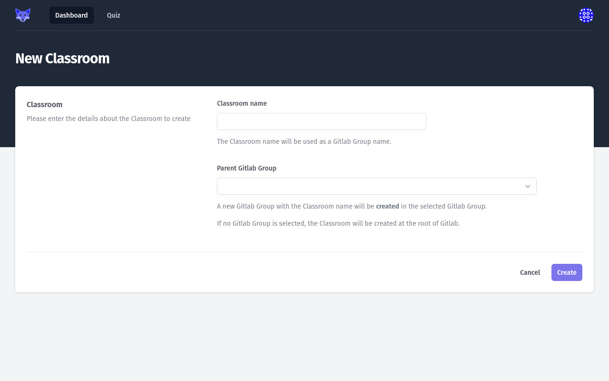
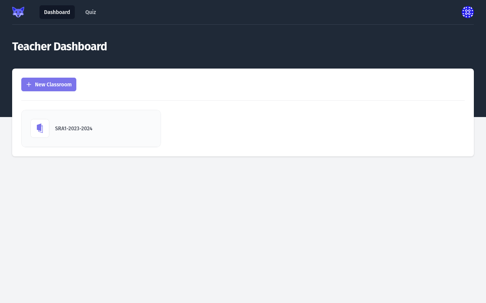
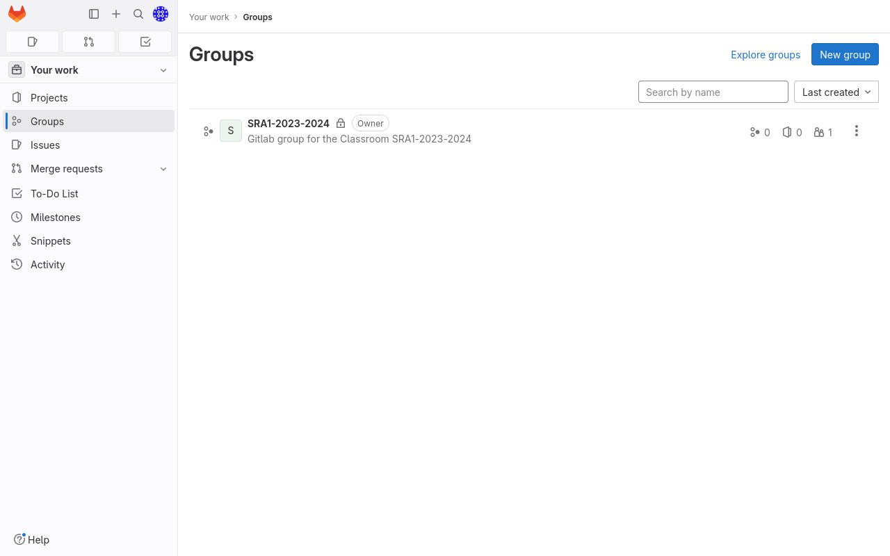

# Creating a _Classroom_

To create a _Classroom_, the _Teacher_ **MUST** input a name.
The _Classroom_ name will be used as a GitLab group name, so it **MUST** be unique for a GitLab instance.

!!! tip

    To ensure that the name is unique, you can include the current year when naming your Classroom.
    e.g : `SRA1-2023`, or `ALOM-2023`

<figure markdown>
  { style="border: solid 1px black" }
  <figcaption>Create Classroom Page</figcaption>
</figure>

If you want the GitLab group of your _Classroom_ to be created in an existing GitLab group (as a nested group), you can select a group in the provided list, under _Parent GitLab Group_.
This list only contains the GitLab groups the connected user has access to.

If you do not select a _Parent GitLab Group_, the GitLab group of your _Classroom_ will be created as a top-level group in your GitLab instance.

After the _Classroom_ creation, you are redirected to the [_Dashboard_](./01-teacher-dashboard.md).

The _Dashboard_ now lists the existing _Classroom_.

<figure markdown>
  { style="border: solid 1px black" }
  <figcaption>Teacher Dashboard showing the created Classroom</figcaption>
</figure>

The _Classroom_ creation creates a GitLab group.
You should be able to see it when connecting to your GitLab instance.

<figure markdown>
  { style="border: solid 1px black" }
  <figcaption>GitLab Group for the created Classroom</figcaption>
</figure>
