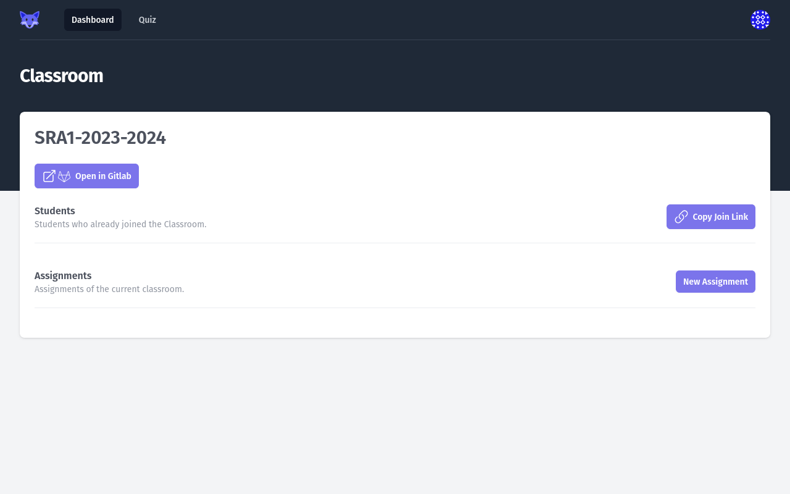
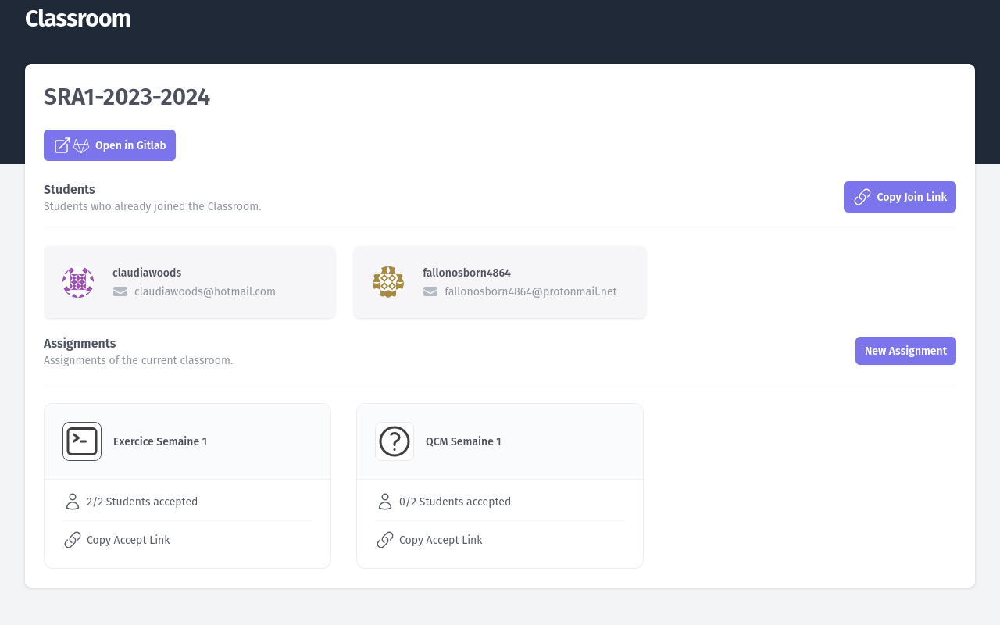
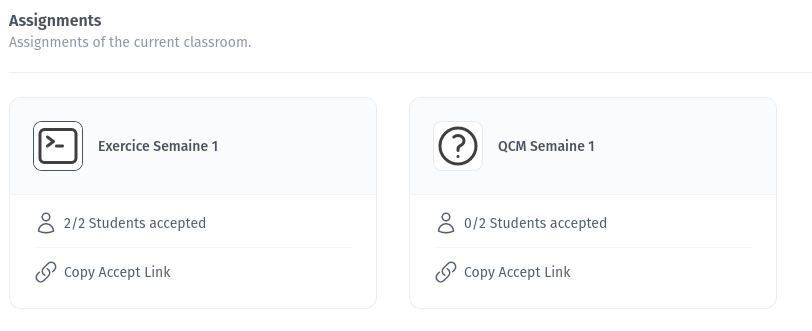

# The _Classroom_ page

The _Classroom_ page is accessed when clicking a _Classroom_ card in the [_Teacher Dashboard_](./01-teacher-dashboard.md).

The _Classroom_ page lists:

* The _Students_ who joined the _Classroom_.
* The _Assignments_ of the _Classroom_.

It also provides a link to access the GitLab Group of the _Classroom_ on your GitLab instance and a [_Join Link_](../student/02-joining-classroom.md)
and a button to [create an _Assignment_](./04-creating-assignment.md).

When the _Classroom_ is just created, it displays an empty view.

<figure markdown>
  { style="border: solid 1px black" }
  <figcaption>Empty Classroom</figcaption>
</figure>

When the _Classroom_ has _Students_ and _Assignments_, it will show them as cards.

<figure markdown>
  { style="border: solid 1px black" }
  <figcaption>Classroom with 2 Students and 2 Assignments</figcaption>
</figure>

## The _Join Link_

The _Join Link_ is a magic link you can give to your _Students_ to [join your _Classroom_](../student/02-joining-classroom.md).

After joining the _Classroom_, the _Students_ will be listed in the _Student_ list, and will be able to accept _Assignments_.

Clicking on the _Copy Join Link_ button copies the link to your clipboard, so you can paste it using <kbd>Ctrl</kbd> + <kbd>V</kbd>, or <kbd>Shift</kbd> + <kbd>Insert</kbd>.

## The _Student_ list

This section lists all the _Students_ that joined the _Classroom_ by using the _Join Link_.

Each card show the _Student_ GitLab avatar, the _Student_ GitLab user name, and the _Student_ email. 

<figure markdown>
  { style="border: solid 1px black" }
  <figcaption>The Student list for a Classroom</figcaption>
</figure>

## The _Assignments_ list

This section lists all the _Assignments_ of the _Classroom_.

Each card show the _Assignment_ type (Exercise or Quiz) with an icon, the _Assignment_ name, the number of _Students_ who already accepted the _Assignment_, and the _Accept Link_ button.

<figure markdown>
  { style="border: solid 1px black" }
  <figcaption>The Assignment list for a Classroom</figcaption>
</figure>

Clicking on the Assignment name will open the [_Assignment submissions_](./05-view-assignment-results.md) page.

Clicking on the _Copy Accept Link_ button copies the link to your clipboard, so you can paste it using <kbd>Ctrl</kbd> + <kbd>V</kbd>, or <kbd>Shift</kbd> + <kbd>Insert</kbd>.
The _Accept Link_ is a magic link you can give to your _Students_ to [accept your _Assignments_](../student/03-accepting-assignment.md).
