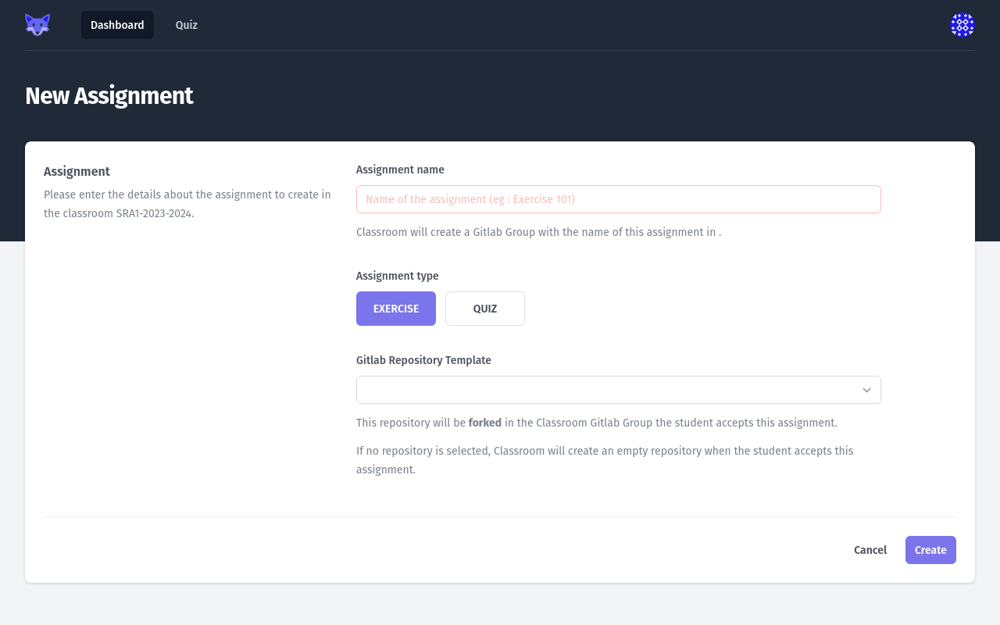
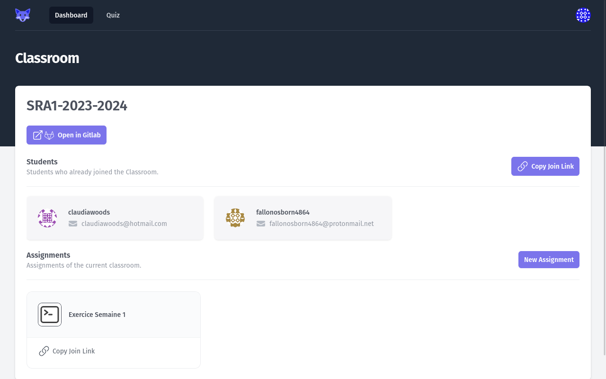
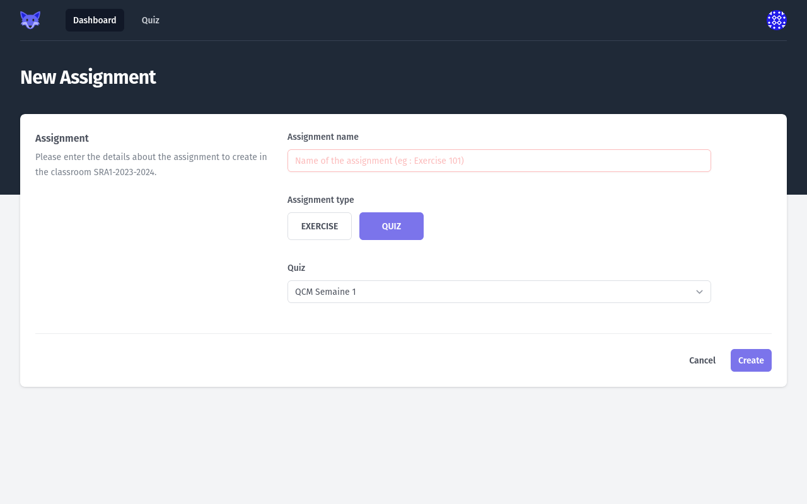

# Creating an _Assignment_

There are 2 types of _Assignments_:

* Quiz: this type of assignment is a multiple-choice questions quiz, that the _Teacher_ can create to validate the _Students_ knowledge.
* Exercise: this type of assignment is a practical exercise, taking the form of a source-code submission to a GitLab repository.

## Creating an _Exercise Assignment_

To create an _Exercise Assignment_, the _Teacher_ **MUST** input a name.
_GitLab Classroom_ will create a nested GitLab group for the _Assignment_, using the name of the _Assignment_, in the group of the _Classroom_.

The _Teacher_ **MAY** select a _GitLab Repository Template_. 
If no template is selected, _GitLab Classroom_ will create an empty repository when each _Student_ accepts the _Assignment_.
If a template is selected, _GitLab Classroom_ will **fork** the selected repository when each _Student_ accepts the _Assignment_, then delete the fork relationship between the template repository and the _Student_ repository.
This contains the GitLab projects the connected user has access to.

<figure markdown>
  { style="border: solid 1px black" }
  <figcaption>Create Assigment Page</figcaption>
</figure>

After creation, the _Exercise Assignment_ will appear as a card in the [_Teacher Dashboard_](./01-teacher-dashboard.md) page.
Clicking on the _Exercise Assignment_ card will open the _Assignment Details_ page.

<figure markdown>
  { style="border: solid 1px black" }
  <figcaption>The created Assignment on the Teacher Dashboard</figcaption>
</figure>

## Creating a _Quiz Assignment_

To create an _Exercise Assignment_, the _Teacher_ **MUST** input a name, and select an existing _Quiz_ in the list.

<figure markdown>
  { style="border: solid 1px black" }
  <figcaption>Create Quiz Assignment Page</figcaption>
</figure>

After creation, the _Quiz Assignment_ will appear as a card in the [_Teacher Dashboard_](./01-teacher-dashboard.md) page.
Clicking on the _Quiz Assignment_ card will open the _Assignment Details_ page.
