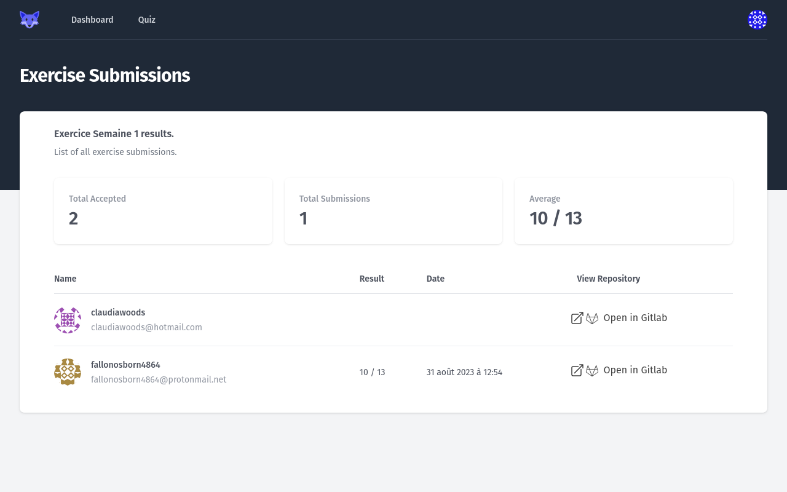

# Viewing _Assignment_ submissions

When clicking an _Assignment_ on the _Teacher Dashboard_, the _Teacher_ is redirected to the _Assignment Submissions_ view.

The views are similar for the 2 types of _Assignments_, _Exercise_ or _Quiz_.

## _Exercise Assignment_ submissions

<figure markdown>
  { style="border: solid 1px black" }
  <figcaption>An Exercise Assignment submissions view</figcaption>
</figure>

The view shows:

* the total count of _Students_ that accepted the _Assignment_
* the total count of submissions by the _Students_
* the average grade of the _Assignment_
* for each _Student_:
    * the grade of the _Student_ for the assignment
    * the submission date of the assignment
    * the link to the GitLab project

## _Quiz Assignment_ submissions

<figure markdown>
  { style="border: solid 1px black" }
  <figcaption>A Quiz Assignment submissions view</figcaption>
</figure>

The view shows:

* the total count of submissions by the _Students_
* for each _Student_:
    * the score obtained at the Quiz
    * the date of last submission
