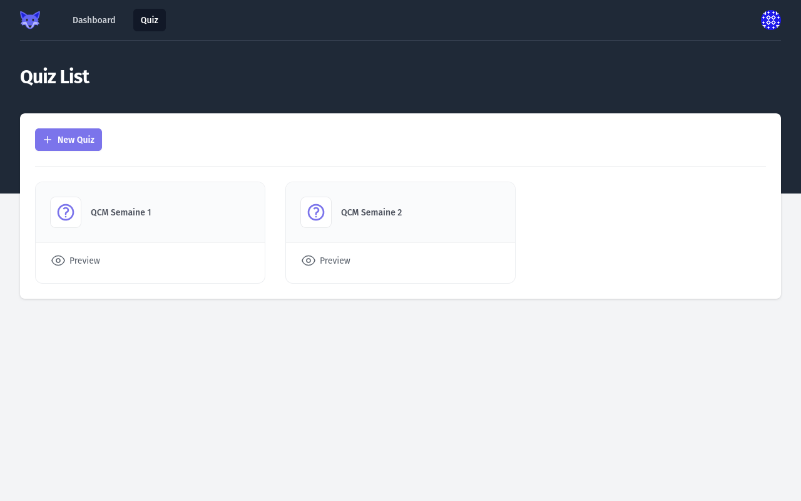
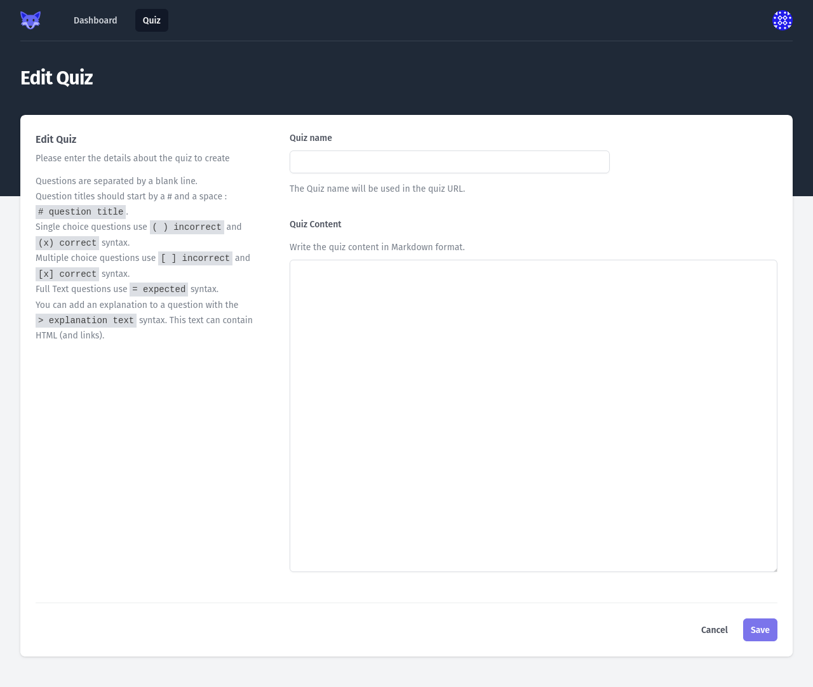
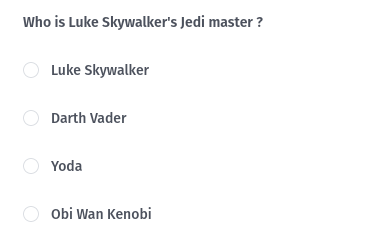
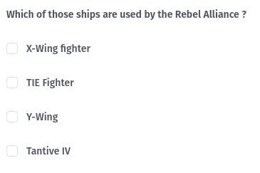
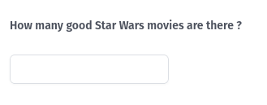

# Creating a Quiz

By clicking the _Quiz_ button in the top navigation, the _Teacher_ is redirected to the _Quiz_ list page.

## Quiz list

<figure markdown>
  { style="border: solid 1px black" }
  <figcaption>Quiz list view</figcaption>
</figure>

The list show a card for each existing _Quiz_ and a button to create a new _Quiz_.

Clicking on the _Quiz_ name will open the _Quiz edition_ page.

Clicking on _Preview Quiz_ will open a page so that the _Teacher_ can preview a _Quiz_ before submitting it to _Students_ as an [_Assignment_](./04-creating-assignment.md).

## Quiz Edition

<figure markdown>
  { style="border: solid 1px black" }
  <figcaption>Quiz edition view</figcaption>
</figure>

The _Quiz Edition_ view shows 2 fields:

* the name of the _Quiz_ (which is mandatory)
* the content of the _Quiz_

Clicking on the _Save_ button at the bottom of the screen will save the _Quiz_ and redirect to the _Quiz List_ view. 

## Writing a _Quiz_

The content of the _Quiz_ is written in Markdown format.

Questions are separated by a blank line.

The question title is a level-1 Markdown title, written using a `# ` at the start of the line.
e.g. `# Who is Luke Skywalker's Jedi master ?`

### Single-choice Questions

Single-choice questions are written using parenthesis `( )`. The correct answer should contain a `x` in the parenthesis `(x)`. Incorrect answers contain a space character in the parenthesis `( )`. A space character MUST separate the parenthesis and the answer label.

Single-choice questions can contain any number of answers. Only one answer can be correct.

```markdown title="A single-choice question"
# Who is Luke Skywalker's Jedi master ?
( ) Luke Skywalker
( ) Darth Vader
(x) Yoda
( ) Obi Wan Kenobi
```

Single-choice questions are rendered using radio buttons.

<figure markdown>
  { style="border: solid 1px black" }
  <figcaption>A single-choice question</figcaption>
</figure>

### Multiple-choice Questions

Multiple-choice questions are written using brackets `[ ]`. The correct answers should contain a `x` in the brackets `[x]`. Incorrect answers contain a space character in the brackets `[ ]`. A space character MUST separate the brackets and the answer label.

Single-choice questions can contain any number of answers (correct or incorrect).

```markdown title="A multiple-choice question"
# Which of those ships are used by the Rebel Alliance ?
[x] X-Wing fighter
[ ] TIE Fighter
[x] Y-Wing
[x] Tantive IV
```

Multiple-choice questions are rendered using checkboxes.

<figure markdown>
  { style="border: solid 1px black" }
  <figcaption>A multiple-choice question</figcaption>
</figure>

### Full-text Questions

Full-text questions are written using a equal sign `>`. The correct answer follows the sign. A space character MUST separate the equal sign and the answer label.

Full-text questions can only have one answer.

```markdown title="A full-text question"
# How many good Star Wars movies are there ?
= 3
```

Full-text questions are rendered using a simple text input.

<figure markdown>
  { style="border: solid 1px black" }
  <figcaption>A full-text question</figcaption>
</figure>

### Question explanations

After each question, an explanation can be added using a Markdown blockquote syntax `> `. 
This explanation text is rendered to the _Student_ after the Quiz submission, and can be an explanation of the correct answer, or a link to a course material for example.

```markdown title="A full-text question with an explanation"
# How many good Star Wars movies are there ?
= 3
> 'A New Hope', 'The Empire Strickes Back', 'Return of the Jedi'.
```

Explanations can be multi-line, and must be declared directly after the question answers (no blank line separation).

Explanations can also contain HTML, such as links.

```markdown title="A single-choice question with an HTML link explanation"
# Who is Luke Skywalker's Jedi master ?
( ) Luke Skywalker
( ) Darth Vader
(x) Yoda
( ) Obi Wan Kenobi
> Find the answer on <a href="https://en.wikipedia.org/wiki/Luke_Skywalker">Wikipedia</a>
```

### Complete Quiz example

Below is a complete Quiz example, with 3 questions, each of one type, and explanations on each question.

```markdown title="A complete Quiz"
# Who is Luke Skywalker's Jedi master ?
( ) Luke Skywalker
( ) Darth Vader
(x) Yoda
( ) Obi Wan Kenobi

# Which of those ships are used by the Rebel Alliance ?
[x] X-Wing fighter
[ ] TIE Fighter
[x] Y-Wing
[x] Tantive IV

# How many good Star Wars movies are there ?
= 3
```
