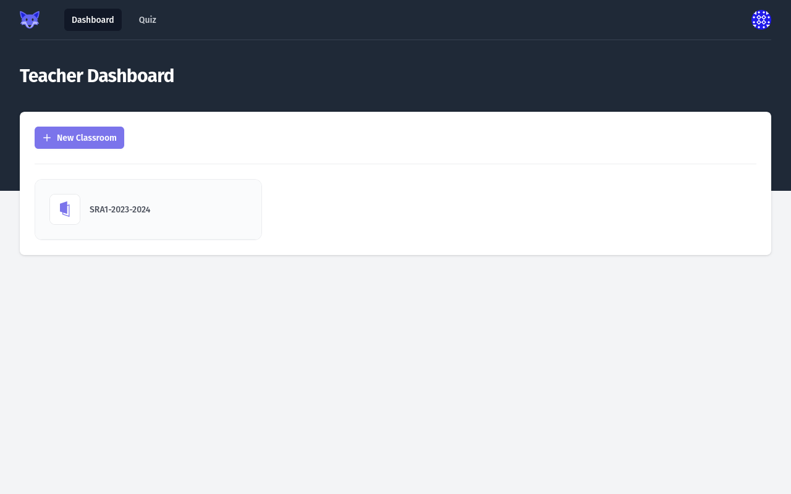

# Using the _Teacher_ dashboard

From this dashboard, a _Teacher_ can:

* view all the _Classrooms_
* [create a new _Classroom_](./creating-classroom.md)
* access details of an existing _Classroom_ by clicking its card.

## Empty dashboard

When empty, the _Teacher_ dashboard displays a link to the [_Create Classroom_](./creating-classroom.md) page.

<figure markdown>
  { style="border: solid 1px black" }
  <figcaption>Empty Teacher dashboard</figcaption>
</figure>

## Typical dashboard

When at least one _Classroom_ exists, the list of the _Classrooms_ is show on the _Teacher_ dashboard.

Each _Classroom_ is represented by a card.

<figure markdown>
  { style="border: solid 1px black" }
  <figcaption>Teacher dashboard with a Classroom</figcaption>
</figure>

### Accessing a _Classroom_

Clicking on a _Classroom_ card name in the _Teacher_ dashboard opens the _Classroom_ page.
